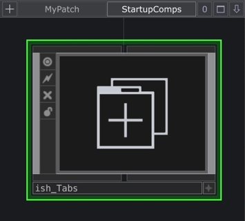

# [TD-Comps](./README.md) -> TD Tabs v0.3

**TD Tabs** is a TouchDesigner component that enhances navigation throught node networks using tabs and a few mouse shortcuts. All tabs are saved in your current project file and work starting from ***2022.35320*** version.

## Installation

Download: [Gumroad](https://ish0.gumroad.com/l/td-Tabs)
| [Github](https://github.com/ish-/TD-Comps/blob/main/TD-Tabs.md)

Drop it into existing projects and save it into your `Custom Startup File` project to have it available later.

## Shortcuts

- `Alt + DblClick/Enter/I/U` - Create a tab using a default TD action.
- `Alt + Click into Pathbar` - Also works the same way
- `Ctrl + T` — Duplicate tab
- `Ctrl + (Shift) + Tab` — Switch between tabs
- `Ctrl + W` — Close current tab and select the previous one

Optional: 
- `Ctrl + Shift + Click` - Jump to clicked component or level up
- `Ctrl + Shift + Alt + Click` - Same action, but in new tab

### MacOS

- `Alt + (Shift) + Tab` — Switch between tabs. `Ctrl` unexpectedly doesnt work.

## TODO:

- Support for other panes (not just `pane1`)
- Possibly integrate with TD's bookmark system?

## Known limitations (due to TouchDesigner constraints)
- The component appears only after the first interaction with the current pane, since `ui.panes.current` isn't initialized at startup.
- Some of shortcut and architecture decisions.

Hopefully, these will be improved in future TD versions.

Thank you for your interest, I hope you will find it useful.
Feel free to leave a feedback, ideas and suggestions on the [ISSUES](https://github.com/ish-/TD-Comps/issues) page.